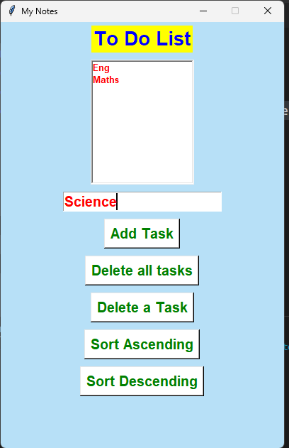

# 📋 My Notes - To Do List App 📝

Welcome to My Notes! 🎉 This is a simple To-Do List application built with Python and Tkinter. 🖥️ You can easily manage your tasks by adding, deleting, and sorting them in ascending or descending order! 🎯💪

## 🚀 Features 🚀

- Add Tasks 🖊️
- Delete Tasks 🗑️
- Delete All Tasks 🚮
- Sort Tasks 🗂️ (Ascending & Descending)
- Dynamic Background Color 🎨
- Intuitive UI 🌟

## 💡 Installation 💡

To get started with this project, follow these simple steps:

1️⃣ Clone the repository:
`git clone https://github.com/SangeetaSharma73/TO-do-list.git`

2️⃣ Install dependencies:
Make sure you have Python installed on your system. You may need to install the Tkinter library if it's not already installed:

`pip install tk`

3️⃣ Run the application:
Launch the app with the following command:
`python ToDoList.py`

## 🌟 How to Use 🌟

1. Add a Task 📝: Type your task in the input field and click "Add Task" to add it to the list.
2. Delete a Task 🗑️: Select a task from the list and click "Delete a Task" to remove it.
3. Delete All Tasks 🚮: Click "Delete all tasks" to clear the entire list.
4. Sort Tasks 🗂️: Click "Sort Ascending" to arrange tasks in ascending order or "Sort Descending" to arrange them in reverse order.
5. The background color 🎨 is randomly generated each time the app is opened, giving it a fresh and dynamic look!

## 💬 Contributing 💬
Feel free to fork the repository 🍴, submit issues 🐞, and create pull requests 🔄! Contributions are always welcome! 🙌

## 📸 Screenshots 📸
- Here’s a preview of how the application looks:

## 📄 License 📄
This project is licensed under the MIT License - see the LICENSE.md file for details. ⚖️
